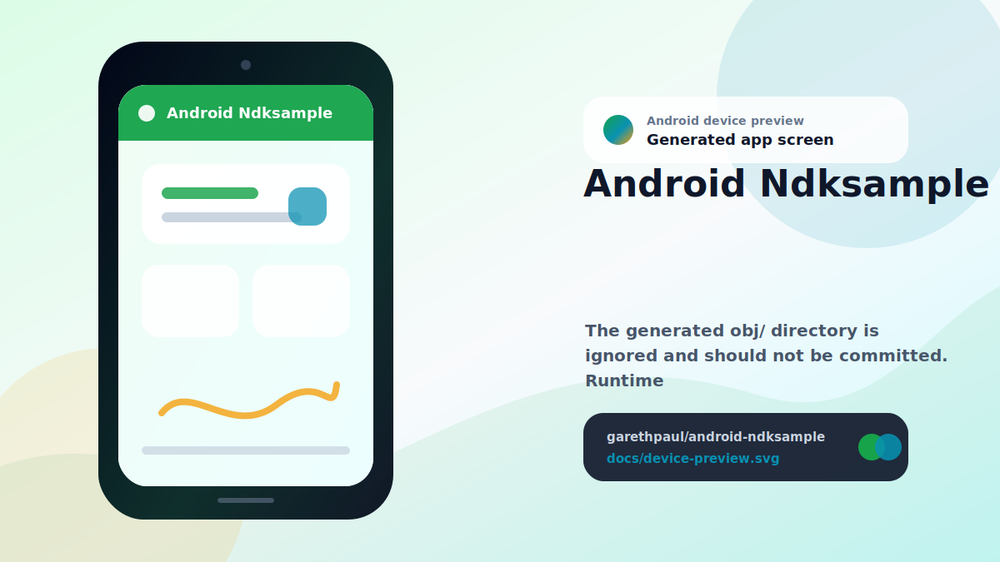

# android-ndksample

<!-- README-OVERVIEW-IMAGE -->


## Device Preview

<!-- DEVICE-PREVIEW-IMAGE -->


## Overview

Legacy Android NDK sample for the San Angeles Observation OpenGL ES demo.

## Project Shape

This repository preserves an older Ant/NDK Android project:

- `project.properties` declares the legacy Android target.
- `AndroidManifest.xml` and `src/` contain the Android activity wrapper.
- `jni/` contains the native C source, NDK makefiles, and upstream license files.
- `libs/*/libsanangeles.so` contains checked-in runtime native libraries for the current sample.
- `libs/SHA256SUMS` records checksums for the checked-in runtime libraries.

The generated `obj/` directory is ignored and should not be committed. Runtime
libraries in `libs/` are kept until they can be regenerated with a documented
NDK version and smoke-tested on an emulator or device.
`libs/SHA256SUMS` records the current checksum for each checked-in runtime
library. Entries must use lowercase SHA-256 digests and repo-relative paths for
the expected `libs/<abi>/libsanangeles.so` runtime libraries.

## Verify

Run the SDK-free baseline check through the root wrapper:

```sh
make check
```

The root Makefile also exposes the standard gate names:

```sh
make lint
make test
make build
```

`make lint` runs the SDK-free provenance check and Android lint when the legacy
SDK lint tool is available. `make test` reruns the SDK-free provenance check.
`make build` runs `ndk-build` when available and otherwise reports a clear skip.

or run the underlying script directly:

```sh
scripts/check-baseline.sh
```

This check validates the repository structure, required native source/license
files, expected ABI runtime libraries, complete checksum manifest coverage for
checked-in native libraries, checksum manifest path hygiene, and `obj/` ignore
policy. It does not require an Android SDK or NDK.
The baseline also verifies that activity destruction calls the existing
`nativeDone()` JNI cleanup path for demo object and imported GL teardown.
JNI bindings use static native signatures that include the `jclass` argument
for the Java static native methods.
Native pause/resume helpers are idempotent so repeated lifecycle callbacks do
not corrupt the demo time offset.
Native render calls are ignored after teardown, repeated cleanup is a no-op,
and repeated native initialization releases the previous resource set first.

If the legacy Android SDK tools are available, run the Ant-project lint gate:

```sh
ANDROID_HOME=/home/gjones/android-sdk ANDROID_SDK_ROOT=/home/gjones/android-sdk \
  /home/gjones/android-sdk/tools/bin/lint --exitcode .
```

`lint.xml` suppresses only findings that are blocked by the current provenance
baseline: no compiled class files, deferred target-SDK policy, no launcher icon,
and no app-indexing intent for this native rendering sample.

## Native Rebuilds

Do not replace checked-in `.so` files without documenting:

- Android NDK version.
- Exact rebuild command.
- Target ABI list.
- Resulting library checksums.
- Runtime launch or smoke-test evidence.
- Confirmation that every checked-in `.so` file is listed in `libs/SHA256SUMS`.
- Confirmation that Java lifecycle changes still invoke native cleanup.
- Confirmation that rebuilt JNI bindings keep the static native signatures
  aligned with the Java declarations.
- Confirmation that native pause/resume helpers remain idempotent across
  repeated lifecycle callbacks.
- Confirmation that renderer callbacks after native teardown do not use freed
  demo objects.

`ndk-build` is not currently available in this environment, so binary
regeneration is deferred.

## Modernization Notes

A future pass should establish a reproducible NDK rebuild first, then migrate
from Ant/project.properties to a supported Gradle/CMake Android project with
CI, checksums, and emulator or device verification.
