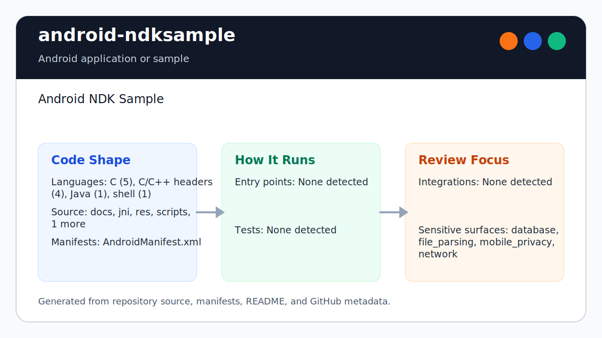

# Android NDK Sample

<!-- README-OVERVIEW-IMAGE -->


Legacy Android NDK sample for the San Angeles Observation OpenGL ES demo.

## Project Shape

This repository preserves an older Ant/NDK Android project:

- `project.properties` declares the legacy Android target.
- `AndroidManifest.xml` and `src/` contain the Android activity wrapper.
- `jni/` contains the native C source, NDK makefiles, and upstream license files.
- `libs/*/libsanangeles.so` contains checked-in runtime native libraries for the current sample.

The generated `obj/` directory is ignored and should not be committed. Runtime
libraries in `libs/` are kept until they can be regenerated with a documented
NDK version and smoke-tested on an emulator or device.

## Verify

Run the SDK-free baseline check:

```sh
scripts/check-baseline.sh
```

This check validates the repository structure, required native source/license
files, expected ABI runtime libraries, and `obj/` ignore policy. It does not
require an Android SDK or NDK.

If the legacy Android SDK tools are available, run the Ant-project lint gate:

```sh
ANDROID_HOME=/home/gjones/android-sdk ANDROID_SDK_ROOT=/home/gjones/android-sdk \
  /home/gjones/android-sdk/tools/bin/lint --exitcode .
```

`lint.xml` suppresses only findings that are blocked by the current provenance
baseline: no compiled class files, deferred target-SDK policy, no launcher icon,
and no app-indexing intent for this native rendering sample.

## Native Rebuilds

Do not replace checked-in `.so` files without documenting:

- Android NDK version.
- Exact rebuild command.
- Target ABI list.
- Resulting library checksums.
- Runtime launch or smoke-test evidence.

`ndk-build` is not currently available in this environment, so binary
regeneration is deferred.

## Modernization Notes

A future pass should establish a reproducible NDK rebuild first, then migrate
from Ant/project.properties to a supported Gradle/CMake Android project with
CI, checksums, and emulator or device verification.
